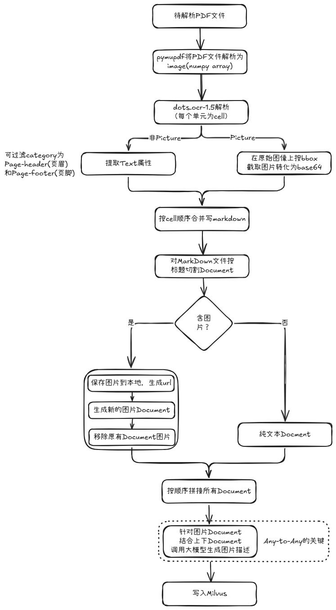
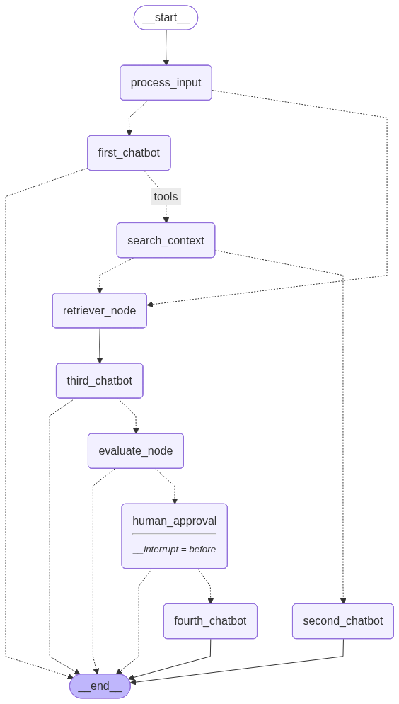
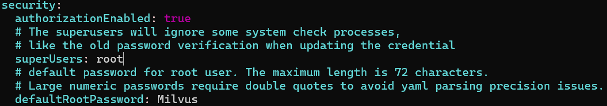
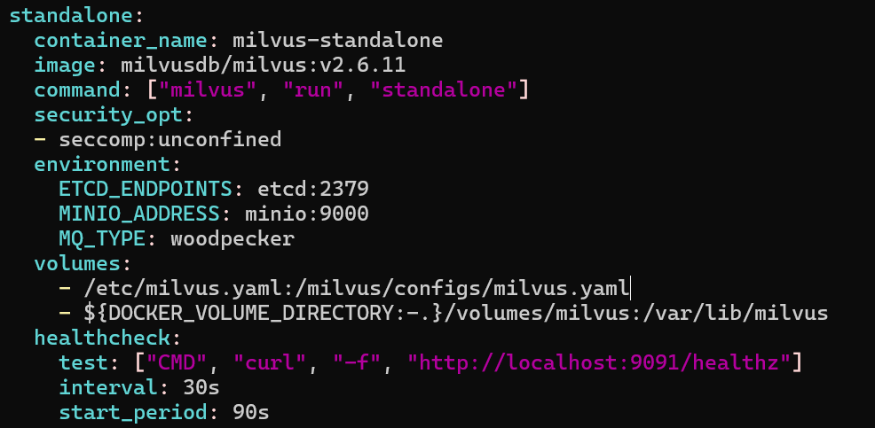
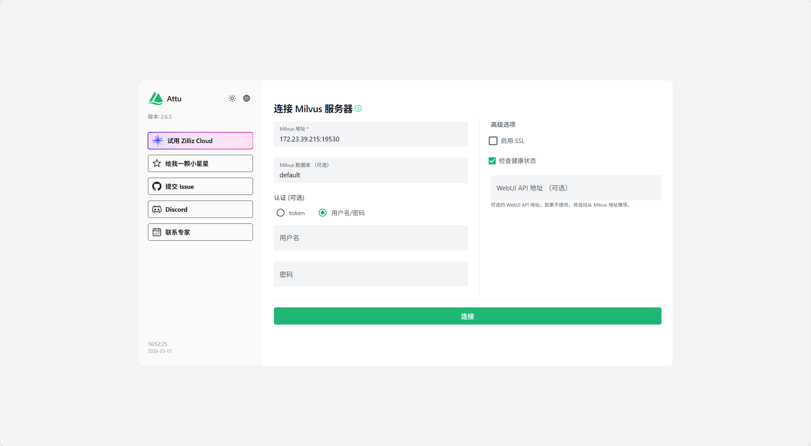

# multimodal-RAG

## 环境说明
+ 多模态对话模型：Qwen3-VL-4B-Instruct
+ 多模态表征模型：Qwen3-VL-Embedding-2B
+ 语义切割文本表征模型：Qwen3-Embedding-0.6B
+ OCR模型：dots.ocr-1.5
+ 向量存储：milvus v2.6.11

## 整体架构
### 构建知识库


### 多模态RAG


1. process_input: 抽取用户输入的文本和图片，如果用户只输入的图片，则直接进行知识库检索(图像不能从长期记忆检索)
2. first_chatbot: 基于短期记忆(messages)回答用户问题，如果短期记忆满足不了回答问题的要求，则调用工具检索长期记忆
3. second_chatbot: 如果长期记忆中有记录，则抽取分数最高的一条进行回答
4. retriever_node: 长期记忆中没有记录，则查询知识库召回chunk
5. third_chatbot: 基于知识chunk进行回答，如果用户输入只有图片则跳过评估模块，如果用户输入含有文本则进入评估模块
6. evaluate_node: 采用ragas评估问题和答案的相关性，相关性高直接回复，相关性低则进入human-in-the-loop
7. human_approval: 用于拒绝答案(rejected)，则进入兜底回答
8. fourth_chatbot: 兜底回复

## 目录结构
```
multimodal-RAG
├── data                                        # 保存解析后的markdown
├── dots_ocr
│   ├── __init__.py
│   ├── inference.py                            # 只提取文字，不提取图片
│   └── parser.py                               # dots.orc解析，解析**流程入口**，交付解析后的markdown文件
├── evaluate
│   ├── __init__.py
│   └── evaluate.py                             # ragas评估
├── img
├── milvus
│   ├── __init__.py
│   ├── create_milvus_collection.py             # 创建milvus表，含知识库表和上下文表
│   ├── create_milvus_collection_template.py    # 创建milvus表模版脚本
│   ├── milvus_operator.py                      # milvus入库流程，被splitter/splitter.py调用
│   └── milvus_retriever.py                     # milvus检索，含语义检索、全文检索和混合检索
├── splitter
│   ├── __init__.py
│   └── splitter.py                             # markdown转化为chunk的**流程入口**
├── utils
│   ├── __init__.py
│   ├── embedding_utils.py                      # 文本embedding和多模态embedding
│   ├── log_utils.py                            # 日志工具
│   ├── model_utils.py                          # 多模态聊天模型
│   └── os_utils.py                             # 系统级别工具，主要为获取排完序的文件列表
└── workflow
    ├── __init__.py
    ├── context_saver.py                        # 上下文异步保存milvus
    ├── evaluate_node.py                        # 评估节点
    ├── multimodal_rag_workflow.py              # 多模态RAG工作流**主流程**
    ├── print_messages.py                       # 打印message
    ├── retrieve_node.py                        # 知识库召回节点
    ├── router.py                               # 条件边路由函数
    ├── search_node.py                          # 上下文搜索节点
    ├── tools.py                                # 上下文搜索工具
    └── workflow_state.py                       # 工作流状态定义
```
---
## dots.ocr-1.5 vllm部署
### 问题
+ 模型下载后的目录名称中不能含有"."，因为目录名需要作为python包名，注入vllm
+ dots.ocr-1.5的模型文件中缺少modeling_dots_ocr_vllm.py文件，需要从dots.ocr的模型文件复制过来
+ 官方推荐的transformers==4.56.1版本与vllm==0.9.1版本会冲突，需要降低版本为transformers==4.53.2
### 模型部署
#### python环境
```shell
conda create -n dotsOCR python=3.12
```
#### pip安装
```shell
pip install vllm==0.9.1
pip install transformers==4.53.2
pip install torch==2.7.0 torchvision==0.22.0 torchaudio==2.7.0 --index-url https://download.pytorch.org/whl/cu128

# flash-attn安装
# 参照cuda、pytorch、python版本选择flash-attn安装，从如下地址下载：
# https://github.com/Dao-AILab/flash-attention/releases
pip install flash_attn-2.8.0.post2+cu12torch2.7cxx11abiFALSE-cp312-cp312-linux_x86_64.whl
```
#### vllm服务
```shell
# vllm注入
export hf_model_path=/mnt/e/llm/models/rednote-hilab/dots_ocr_1_5
export PYTHONPATH=$(dirname "$hf_model_path"):$PYTHONPATH
sed -i '/^from vllm\.entrypoints\.cli\.main import main$/a\
from dots_ocr_1_5 import modeling_dots_ocr_vllm' `which vllm`

# 服务启动
CUDA_VISIBLE_DEVICES=0 vllm serve \
/mnt/e/llm/models/rednote-hilab/dots_ocr_1_5 \
--tensor-parallel-size 1 \
--gpu-memory-utilization 0.9 \
--chat-template-content-format string \
--served-model-name dots_orc_1_5 \
--trust-remote-code
```

## Qwen3-vl-4B-Instruct部署
### 要求
+ vllm==0.14
+ transformers==4.57.0
+ pytorch==2.8.0
### vllm服务
+ enable-auto-tool-choice: 启用模型的自动工具选择能力，让模型能够自主决定何时调用工具
+ tool-call-parser: 指定工具调用的解析器为 hermes
```shell
CUDA_VISIBLE_DEVICES=0 vllm serve \
/mnt/e/llm/models/qwen/Qwen3-VL-4B-Instruct \
--tensor-parallel-size 1 \
--gpu-memory-utilization 0.9 \
--served-model-name Qwen3vl \
--trust-remote-code \
--max-model-len 20480 \
--port 8010 \
--enable-auto-tool-choice \
--tool-call-parser hermes
```
### 请求示例
```shell
curl http://localhost:8000/v1/chat/completions \
  -H "Content-Type: application/json" \
  -d '{
    "model": "Qwen3vl",
    "messages": [
      {
        "role": "user",
        "content": [
          {
            "type": "text",
            "text": "这张图片里有什么？"
          },
          {
            "type": "image_url",
            "image_url": {
              "url": "https://qianwen-res.oss-cn-beijing.aliyuncs.com/Qwen-VL/assets/demo.jpeg"
            }
          }
        ]
      }
    ],
    "max_tokens": 300
  }'
```

## Qwen3-VL-Embedding-2B部署
### 要求
+ vllm==0.14: 版本来源：https://github.com/QwenLM/Qwen3-VL-Embedding/blob/main/examples/embedding_vllm.ipynb
+ transformers>=4.57.0
+ pytorch==2.8.0
### vllm服务
```shell
# embedding、classification、reward model都是pooling模型
# runner参数可选：auto, draft, generate, pooling
CUDA_VISIBLE_DEVICES=0 vllm serve \
/mnt/e/llm/models/qwen/Qwen3-VL-Embedding-2B \
--served_model_name Qwen3vl-Embedding \
--runner pooling \
--trust-remote-code \
--max-model-len 65536 \
--port 8020
```

## Qwen3 Embedding模型部署
项目使用的是：Qwen3-Embedding-0.6B，主要用于**语义分割**。语义分割原理：计算两两句子的相似性，如果相似性低于某个阈值，则切割
### 要求
+ vllm==0.8.5
+ transformers==4.51.1
### vllm服务
```shell
CUDA_VISIBLE_DEVICES=0 vllm serve \
/mnt/e/llm/models/qwen/Qwen3-Embedding-0.6B \
--served_model_name Qwen3-Embedding \
--task embed \
--trust-remote-code \
--port 8000
```

## neo4j部署
版本选择：5.26.8
下载地址：<a href="https://neo4j.ac.cn/deployment-center">neo4j下载地址</a>
### 安装
```shell
sudo apt install cypher-shell_5.26.8_all.deb
sudo apt install neo4j_5.26.8_all.deb
```
### 编辑neo4j配置
监听所有ip请求，默认localhost
```shell
 server.default_listen_address=0.0.0.0
```
### 启动服务
启动服务后，访问web ui:  
http://localhost:7474
```shell
# 设置初始密码，最开始密码默认是neo4j
neo4j-admin dbms set-initial-password neo4j123
# 启动服务
systemctl start neo4j
```
### 安装apoc
apoc是neo4j的扩展库，为neo4j提供了大量的官方Cypher语法本身不具备的，增强型的过程和函数。在多模态RAG的应用中，能够提供更丰富的schema，让大模型写出更好的cypher sql查询neo4j。
apoc版本需要与neo4j对应，下载地址：<a href="https://github.com/neo4j/apoc/releases/download/5.26.8/apoc-5.26.8-core.jar">apoc下载地址</a>
```shell
# 将下载后的jar包放入到
mv apoc-5.26.8-core.jar /var/lib/neo4j/plugins
# 重启neo4j
systemctl restart neo4j
```

## milvus部署
milvus部署方式有多种：
+ milvus lite是一个python库，只需要指定数据库保存目录即可，适用于几百万个向量的数据规模，**该方式不支持windows环境**
```shell
pip install -U pymilvus 
```
+ standalone，可以通过docker compose部署，也能通过deb或者rpm包部署成系统服务，适用于亿级个向量的数据规模。**本项目采用该方式部署**
+ distributed，需要部署在k8s，适用于亿级到数百亿级个向量的数据规模
> 1. standalone和distributed部署方式可参见<a href="https://milvus.io/docs/zh">milvus官网</a>  
> 2. 图形化界面可采用<a href="https://github.com/zilliztech/attu">Attu</a>
### milvus docker方式安装
+ 下载docker compose配置文件 和 milvus配置文件
```shell
wget https://github.com/milvus-io/milvus/releases/tag/v2.6.11/milvus-standalone-docker-compose.yml -O docker-compose.yml
# 配置文件
cd /etc
wget https://raw.githubusercontent.com/milvus-io/milvus/v2.6.11/configs/milvus.yaml
```

+ 编辑配置文件，启用安全认证


+ 修改docker-compose配置，应用配置文件  
```shell
# 增加一行配置
/etc/milvus.yaml:/milvus/configs/milvus.yaml
```


+ docker compose启动
```shell
# 启动
docker-compose up -d
# 其他命令
docker-compose down # 停止
```

### 图像化界面Attu安装
```shell
# 替换milvus ip为具体的milvus向量数据库的host
# 由于和vllm默认端口冲突，所以代理端口改为8001
docker run -d -p 8001:3000 -e MILVUS_URL=<milvus ip>:19530 zilliz/attu:v2.6
```
打开web ui:
http://localhost:8001

### milvus相关
#### 支持的字段
+ 主键：可指定int或者varchar，如果指定auto_id，int型则自增，varchar型则随机生成一个字符串
+ 密集向量：用于语义匹配
+ 稀疏向量：用于全文检索，需要指定**分词器**，中文用jieba，英文则指定standard
+ 标量：用于过滤和范围检索

#### milvus创建collection模版
参见：milvus/create_milvus_collection_template.py